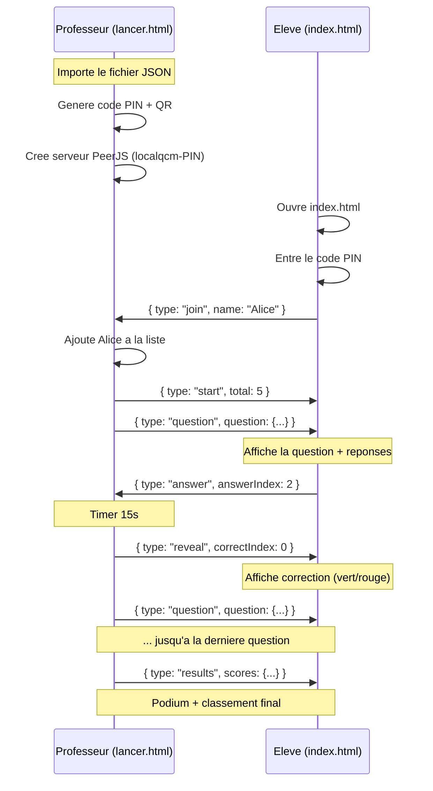
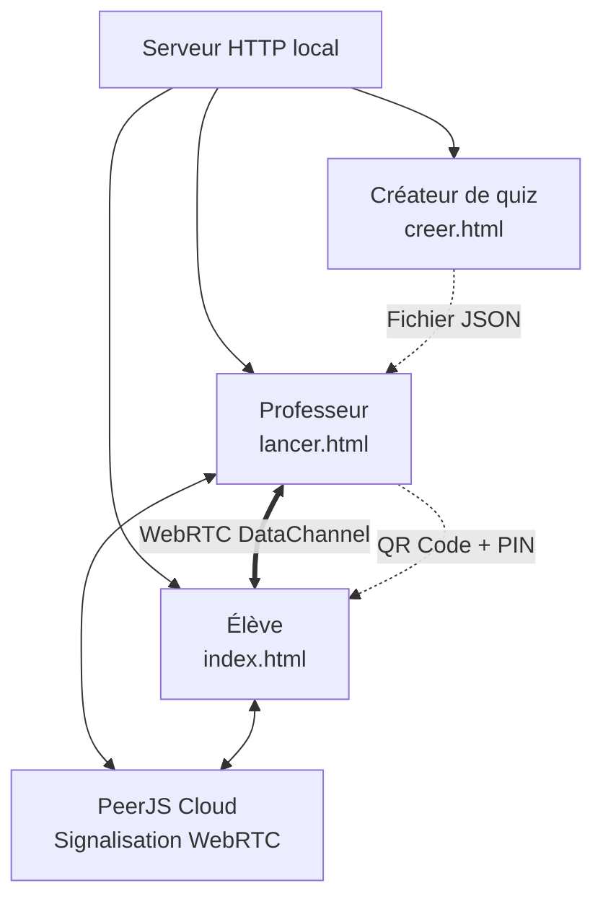

#  Local QCM


> **Plateforme de quiz interactif en réseau local, sans connexion Internet.**

Local QCM permet à un professeur de créer et lancer des questionnaires interactifs. Les élèves rejoignent la session depuis leur smartphone via un **QR Code** ou un **code PIN**, puis répondent en temps réel directement depuis leur navigateur.

Aucun serveur distant n'est nécessaire : la communication se fait en **peer-to-peer (WebRTC)** entre l'ordinateur du professeur et les appareils des participants.

---

# ✨ Fonctionnalités

- ✅ Création de quiz personnalisés
- ✅ Importation et modification de quiz JSON
- ✅ Génération automatique d'un code PIN
- ✅ Génération d'un QR Code de connexion
- ✅ Participation depuis smartphone sans installation d'application
- ✅ Communication temps réel via WebRTC
- ✅ Affichage instantané des questions
- ✅ Correction automatique des réponses
- ✅ Calcul des scores
- ✅ Classement final des participants
- ✅ Fonctionnement sur réseau local
---

# 🚀 Fonctionnement

## 1. Création du quiz

Le professeur crée ou importe un questionnaire depuis :

```
pages/creer.html
pages/importer.html
```

Le quiz est enregistré au format JSON.

---

## 2. Lancement d'une session

Depuis :

```
pages/lancer.html
```

Le professeur démarre une partie.

Local QCM génère automatiquement :

- un identifiant de session
- un code PIN
- un QR Code de connexion

---

## 3. Connexion des élèves

Les élèves ouvrent :

```
index.html
```

Puis :

- scannent le QR Code
- ou saisissent le code PIN

Le smartphone se connecte directement à l'ordinateur du professeur.

---

## 4. Déroulement du quiz

Pendant la partie :

- les questions sont envoyées en temps réel
- les élèves répondent depuis leur téléphone
- les réponses sont transmises instantanément
- les scores sont calculés automatiquement
- le classement final est affiché

---

# 🎮 Deroulement d'une partie



**Echanges detailles :**

| Message | Emetteur | Destinataire | Contenu |
|---|---|---|---|
| **join** | Eleve | Professeur | `{ type: "join", name: "Alice" }` |
| **start** | Professeur | Tous | `{ type: "start", total: 5 }` |
| **question** | Professeur | Tous | `{ type: "question", question: {...}, index: 0 }` |
| **answer** | Eleve | Professeur | `{ type: "answer", answerIndex: 2 }` |
| **reveal** | Professeur | Tous | `{ type: "reveal", correctIndex: 0 }` |
| **results** | Professeur | Tous | `{ type: "results", scores: {...} }` |

Le professeur diffuse les questions et la correction a tout le monde. Chaque eleve envoie uniquement sa reponse.

---

# 🔌 Comprendre WebRTC

WebRTC est une technologie qui permet a deux navigateurs de communiquer **directement** sans passer par un serveur central.

## Comment ca marche dans Local QCM ?

```
Etape 1 - Signalisation (besoin internet)
  Eleve ----> PeerJS Cloud ----> Professeur
  "Je veux rejoindre localqcm-1234"

Etape 2 - Connexion directe (plus besoin d'internet)
  Eleve <========================> Professeur
  Donnees en peer-to-peer via WebRTC
```

**1. Signalisation (PeerJS Cloud)** : quand un eleve scanne le QR, PeerJS contacte son serveur cloud pour trouver le professeur. Cette etape necessite internet, mais elle dure moins d'une seconde.

**2. Data Channel (WebRTC)** : une fois que les deux navigateurs se sont trouves, ils ouvrent un canal de communication direct. Les donnees (questions, reponses) voyagent desormais en peer-to-peer, sans passer par internet.

**3. Pas de donnees stockees** : PeerJS Cloud ne stocke rien. Il sert juste d'intermediaire le temps que les deux pairs se decouvrent. Ensuite, tout passe en local.

## Pourquoi un serveur HTTP ?

Le serveur HTTP (`python3 -m http.server`) sert uniquement les fichiers HTML, CSS et JS au navigateur. C'est comme ouvrir un fichier local, mais en reseau.

Local QCM a besoin de ce serveur car les navigateurs n'autorisent pas WebRTC en `file://`.

---

# 🏗️ Architecture



---

# 🛠️ Technologies utilisées

| Technologie | Utilisation |
|---|---|
| HTML5 | Interface utilisateur |
| CSS3 | Design et mise en page |
| JavaScript | Logique applicative |
| WebRTC | Communication temps réel P2P |
| PeerJS | Gestion simplifiée WebRTC |
| JSON | Stockage des quiz |
| qrcode.js | Génération des QR Codes |

---

# 📂 Structure du projet

```
LocalQCM/

│
├── index.html                  Page d'accueil + interface élève
│
├── pages/
│   ├── creer.html              Création de quiz
│   ├── importer.html           Import / modification quiz
│   └── lancer.html             Interface professeur
│
├── css/
│   ├── global.css              Styles communs
│   ├── importer.css            Style éditeur
│   ├── lancer.css              Style professeur
│   └── rejoindre.css           Style élève
│
├── js/
│   ├── creer.js                Logique création quiz
│   ├── importer.js             Import et modification
│   ├── lancer.js               Serveur de jeu professeur
│   ├── etudiant.js             Client élève
│   ├── peerjs.min.js           Bibliothèque PeerJS
│   └── qrcode.min.js           Génération QR Code
│
├── assets/
│   ├── logo.png
│   ├── fond.png
│   ├── favicon.ico
│   └── icons/
│
├── sample-quiz.json            Exemple de quiz
│
└── README.md
```

---

# ⚙️ Fonctions JavaScript importantes

## `js/lancer.js` — Serveur de jeu professeur

| Fonction | Rôle |
|---|---|
| `handleFile(file)` | Lit et valide le fichier JSON du quiz |
| `startLobby()` | Génère le code PIN et initialise la session |
| `generateQR()` | Génère le QR Code de connexion |
| `initPeer()` | Initialise PeerJS |
| `handlePlayerMessage()` | Traite les messages des élèves |
| `broadcast()` | Envoie des données aux participants |
| `startTimer()` | Lance le compte à rebours |
| `revealAnswer()` | Affiche la correction |
| `showResults()` | Génère le classement final |

---

## `js/etudiant.js` — Client élève

| Fonction | Rôle |
|---|---|
| `connectToHost(code)` | Connecte l'élève au professeur |
| `handleMessage(data)` | Traite les messages reçus |
| `showQuestion()` | Affiche une question |
| `selectAnswer()` | Envoie une réponse |
| `revealAnswer()` | Affiche la correction |
| `showResults()` | Affiche le score final |

---

## `js/creer.js` — Création de quiz

| Fonction | Rôle |
|---|---|
| `renderQuestions()` | Génère l'interface des questions |
| `saveCurrentData()` | Sauvegarde le quiz |
| `toggleCorrect()` | Définit la bonne réponse |
| `addAnswer()` | Ajoute une réponse |
| `deleteAnswer()` | Supprime une réponse |
| `deleteQuestion()` | Supprime une question |

---

## `js/importer.js` — Import et modification

| Fonction | Rôle |
|---|---|
| `handleFile()` | Charge un fichier JSON |
| `loadQuiz()` | Affiche un quiz importé |
| `renderQuestions()` | Reconstruit l'éditeur |
| `saveCurrentData()` | Sauvegarde les modifications |

---

# ▶️ Installation et lancement

Cloner le projet :

```bash
git clone https://github.com/votre-utilisateur/LocalQCM.git

cd LocalQCM
```

Lancer un serveur HTTP :

```bash
python3 -m http.server 8080
```

Puis ouvrir :

```
http://localhost:8080
```

---

# 📱 Utilisation en réseau local

1. Connecter le PC professeur et les smartphones au même réseau Wi-Fi.
2. Lancer Local QCM.
3. Créer une session.
4. Partager le QR Code généré.
5. Les élèves rejoignent la partie.

---

# 📄 Format JSON d'un quiz

```json
{
  "title": "Titre du quiz",
  "author": "Nom du créateur",
  "questions": [
    {
      "text": "Quelle est la capitale du Burkina Faso ?",

      "answers": [
        {
          "text": "Ouagadougou",
          "correct": true
        },
        {
          "text": "Bobo-Dioulasso",
          "correct": false
        }
      ]
    }
  ]
}
```

---

# 📦 Dépendances

## PeerJS

Communication pair-à-pair WebRTC :

https://peerjs.com/


## qrcode.js

Génération de QR Codes :

https://github.com/davidshimjs/qrcodejs

---

# 🔒 Architecture sans backend

```
Ordinateur professeur
          |
          |
       WebRTC
          |
          |
 Smartphones élèves
```

Le serveur HTTP sert uniquement les fichiers statiques.

Les données du quiz et les réponses restent dans le réseau local.

---

# 👥 Contributeurs

Groupe 18 — Projet Local QCM :

- **TAMINI** Dofinizoumou Jean Esaïe
- **BAKO** Alice Carine
- **KIEMA** Espérance Wendkuni
- **YAOGO** Gérard Windpagnangdé
- **KPIELE** Some Kadidia Augustine

---

# 🎯 Objectif du projet

Local QCM a pour objectif de proposer une solution simple, gratuite et accessible pour réaliser des évaluations interactives dans les établissements scolaires, même dans les zones où Internet est limité.

---

# 📜 Licence

Projet open source — Licence à définir.